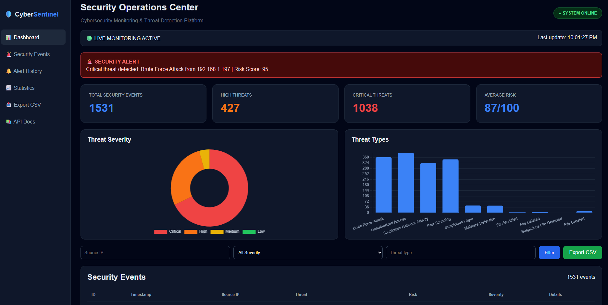

\# 🛡️ CyberSentinel


CyberSentinel is a cybersecurity monitoring and threat detection platform designed to monitor security events, identify potential threats, calculate risk scores, and display security information through a web-based dashboard.


\## 🚀 Features


\- Real-time security event monitoring

\- Threat detection

\- Risk score calculation

\- Severity classification

\- Suspicious login detection

\- Port scanning detection

\- Unauthorized access detection

\- Malware detection

\- Brute force attack detection

\- File monitoring

\- Network monitoring

\- SQLite database integration

\- FastAPI backend

\- Interactive security dashboard

\- Security event table

\- REST API

\- Authentication system

\- Responsive web interface


\## 🏗️ Project Structure


```text

CyberSentinel/

│

├── backend/

│   ├── app.py

│   ├── auth.py

│   └── database/

│

├── database/

│   ├── security\_database.py

│   └── view\_events.py

│

├── detection/

│   ├── \_\_init\_\_.py

│   └── risk\_engine.py

│

├── monitoring/

│   ├── \_\_init\_\_.py

│   ├── file\_monitor.py

│   └── network\_monitor.py

│

├── detector.py

├── monitor.py

├── requirements.txt

├── .gitignore

└── README.md

\## 📸 Dashboard


